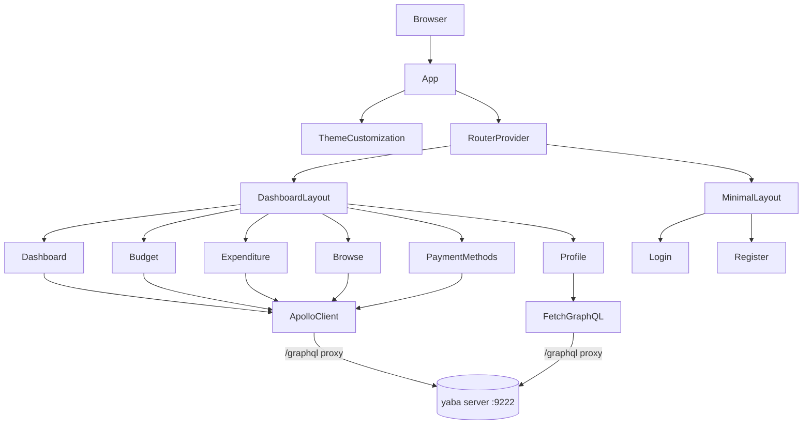
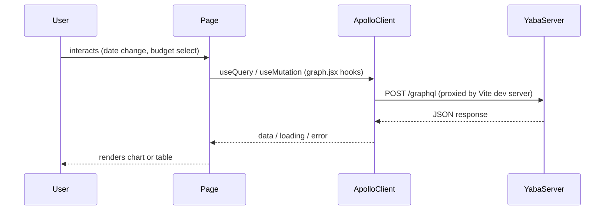

# Codebase Overview

## Purpose

yaba-ui is a React single-page application for managing personal finances — budgets, transactions, payment methods, and credit card rewards. It is the frontend for the yaba backend server.

## Architecture

## Directory Structure

| Directory | Purpose |
|-----------|---------|
| `src/api/` | All GraphQL queries, mutations, and Apollo hooks |
| `src/pages/` | Page-level components, one subdirectory per route |
| `src/components/` | Shared UI components (MainCard, Loadable, DateRangeProvider, etc.) |
| `src/layout/` | Layout shells: `Dashboard` (sidebar + header) and `MinimalLayout` (login) |
| `src/routes/` | React Router configuration (MainRoutes, LoginRoutes) |
| `src/contexts/` | Auth context and reducer |
| `src/themes/` | MUI theme: palette, typography, shadows, component overrides |
| `src/menu-items/` | Sidebar navigation definitions |
| `src/utils/` | Helpers for constants, dates, expense math, color/shadow utilities |

## Key Components

**`src/api/graph.jsx`** — single source of truth for all GraphQL operations. Exports named hook wrappers (`useBudgets`, `usePaymentMethods`, etc.) and raw `gql` documents used across pages.

**`src/pages/budget/BudgetContext.jsx`** — React context that holds the currently selected budget and exposes it to the Dashboard and Expenditure pages (both wrap their trees in `<BudgetProvider>`).

**`src/components/DateRangeProvider.jsx`** — context for the date range filter used on the Dashboard. Consumed via `useDateRange()`.

**`src/components/Loadable.jsx`** — wraps `React.lazy()` pages in a `<Suspense>` boundary with a loading indicator. Used in `MainRoutes.jsx` for all authenticated pages.

**`src/themes/index.jsx`** — MUI `ThemeProvider` wrapper; the root `App.jsx` wraps everything in it.

## Data Flow

The `profile` page is an exception — it uses `fetch('/graphql')` directly with `credentials: 'include'` instead of Apollo Client.

## Dependencies

| Dependency | Role |
|-----------|------|
| `@apollo/client` | GraphQL client and cache |
| `@mui/material` + `@emotion/*` | UI component library and CSS-in-JS |
| `@mui/x-date-pickers` | Date picker components (uses dayjs adapter) |
| `react-router-dom` v6 | Client-side routing |
| `apexcharts` / `react-apexcharts` | Charts on Dashboard |
| `formik` + `yup` | Form state and validation |
| `axios` + `swr` | REST calls to `/api` endpoints |
| `dayjs` | Date manipulation |
| `vite` | Build tool and dev server |
